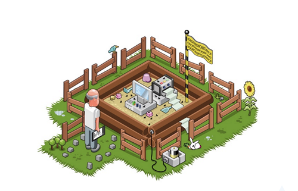

# Building Your Development Sandbox

### Presentation - Development Sandboxes - An Agile best practice

### 00 - Get Prepared
* [Screencast](https://www.youtube.com/embed/-Ci6w1vFF8o)

#### Check / Enable Virtualization in system BIOS
* [ENABLE VIRTUALIZATION (VT-x/AMD-v)](https://www.youtube.com/watch?v=mFJYpT7L5ag)

#### Downloads
* [VirtualBox](https://www.virtualbox.org/wiki/Downloads)
* [VirtualBox Extension Pack](https://www.virtualbox.org/wiki/Downloads)
* [Linux Mint 18](http://blog.linuxmint.com/?p=3052)
* [MS File Integrity Checker](https://support.microsoft.com/en-us/kb/841290)

### 01 - Create a Virtual Machine
* [ScreenCast](https://www.youtube.com/embed/7-2BeZEcaJE)

### 02 - Install Linux Mint
* [Screencast](https://www.youtube.com/embed/uQ5Rymrrznc)

### 03 - Provision
* [Screencast](https://www.youtube.com/embed/-WcNWPHU_MQ)
* Prefix script has moved: https://raw.githubusercontent.com/BurnerCodeSchool/sandbox/master/automated_sandbox.sh

### 04 - Fully Automated Provision
* [Screencast](https://www.youtube.com/embed/3hIwV84BQ6E)
* Automated Sandbox script has moved: https://raw.githubusercontent.com/BurnerCodeSchool/sandbox/master/automated_sandbox.sh
